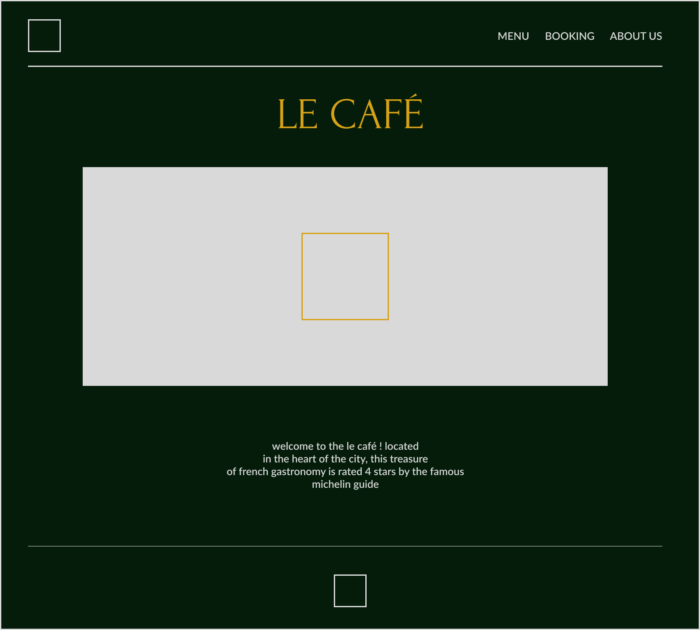

<h3 align="center">Restaurant Page</h3>

  

    Restaurant Page with tabbed browsing. 
     
    <a href="https://notsanta20.github.io/restaurant_page/" target="_blank">Live Demo</a>
  

 

<!-- ABOUT THE PROJECT -->
### Preview

 

### Built With

<!-- ACKNOWLEDGMENTS -->
## Acknowledgments

* Inspiration by <a href="https://www.theodinproject.com/lessons/node-path-javascript-restaurant-page" target="_blank">The Odin Project</a>

* <a href="https://www.behance.net/gallery/156457517/Restaurant-Website-Design-e-commerce-concept" target="_blank">Design Inspiration</a>

* Pictures credit: Unsplash - Tina Dawson, Nathan Dumlao, Sebastian Schuppik, Charles Postiaux, Christina Rumpf
